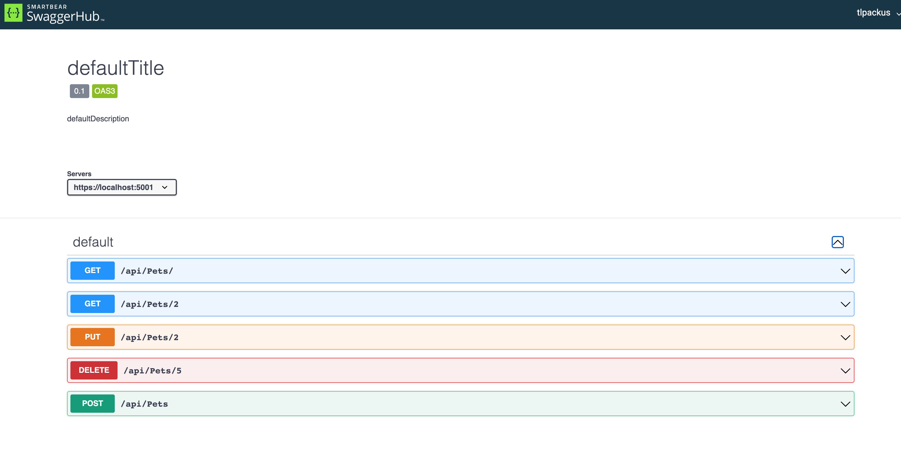
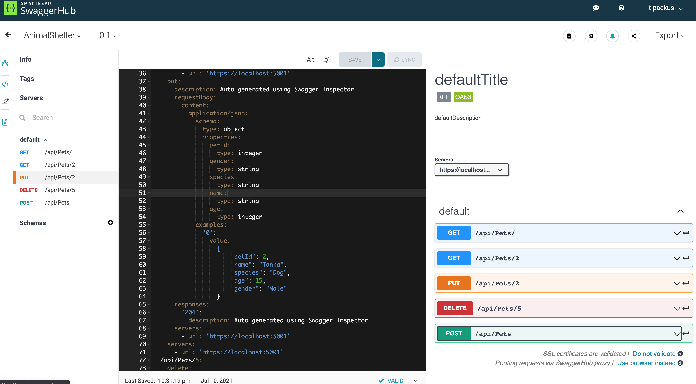

# Animal Shelter Api
### This was an independently created Api for tracking the animals at a shelter/ Epicodus Project

### By Theron Packus

link to swagger documentation:

https://app.swaggerhub.com/apis-docs/tlpackus/AnimalShelter/0.1

## Known Bugs

- No known bugs so please lets me know if you encounter any through the email I provided below.

## License

[MIT](LICENSE.txt)

Copyright © 2021 Theron Packus

All Rights Reserved

## Support and Contact Information

For contact support or any found bugs, please email me here <a href = "mailto: tlpackus@gamil.com">Send Email</a>