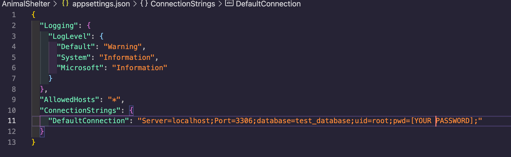

# Animal Shelter Api
### This was an independently created API for tracking the animals at a shelter/ Epicodus Project

### By Theron Packus

## Technologies Used

* C#
* API
* .NET Core 5.0.1
* Entity Framework Core
* ASP.NET Core MVC
* RESTful Routing, CRUD & HTTP
* MySQL & MySQL Workbench
* GitHub 
* Swagger

## Description
_A RESTful API that manages data for an Animal shelter. A user can make different requests to send, retrieve or modify data for available pets at a shelter. Swagger is used to help document this._

## Swagger Documentation

_link to swagger documentation:_
https://app.swaggerhub.com/apis-docs/tlpackus/AnimalShelter/0.1

## Setup/Installation Requirements

* _Requires Visual Studio Code Installation_
* _Requires Terminal Installation_
* _Open the terminal on your local machine_
* _Navigate to the directory inside of which you wish to house this project_
* _Clone this project with the following command  `https://github.com/tlpackus/AnimalShelter.Solution.git`_
* _Next you will need to download and install .NET Core through this link if you don't already have it: https://dotnet.microsoft.com/download_
* _After downloading and installing .NET Core, return to your terminal and navigate to the root directory by entering `$ cd AnimalShelter.Solution`_
* _Open this project in Visual Studio Code with the command `$ code .`_
* _Still in the terminal, navigate to the desired subdirectory of the repository with the command `$ cd AnimalShelter`_
* _Retrieve and install packages listed in the .csproj files with the command `$ dotnet restore`_
* _Create internal content for build with the command `$ dotnet build`_

**Instructions for re-creating the MySQL Database through a migration**
* _Open MySQL Workbench (If you don't already have it, it can be downloaded here: https://dev.mysql.com/downloads/file/?id=484391)_
* _From the `AnimalShelter` directory run command `$ touch appsettings.json` to create a new file._
* _Input the following script_ (**note the name of the database below needs to match the name of the database you created (e.g. test_database)**)

* _Back in the terminal run `$ dotnet ef database update`_
* _Your MySQL Workbench should now show a new Schema added_
* _You can now run $ dotnet run from the AnimalShelter Directory to launch_
* _Copy the local host 5001 server link into Postman or Swagger to test the put, post, and get methods_
* _This API has full CRUD so you can also update through a put method_

## Known Bugs

- No known bugs so please lets me know if you encounter any through the email I provided below.

## License

[MIT](LICENSE.txt)

Copyright © 2021 Theron Packus

All Rights Reserved

## Support and Contact Information

For contact support or any found bugs, please email me here <a href = "mailto: tlpackus@gamil.com">Send Email</a>